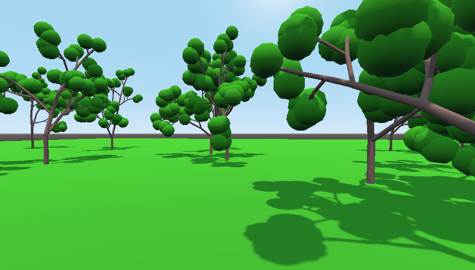
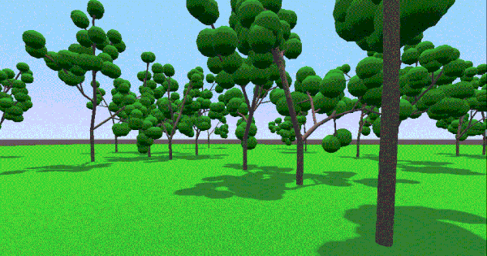

# Tree

Naive implementation of Procedurally Generated Tree in Godot with swaying motion.

Check out https://owenl131.github.io/Tree/.
Controls: Up, Down, Left, Right, PgUp, PgDn

And... a screen recording:

